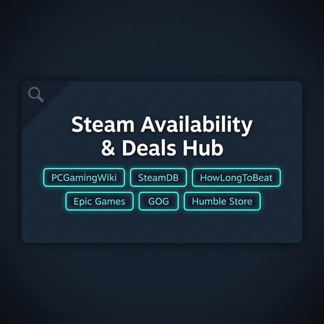

# Steam Availability & Deals Hub

A [Millennium](https://github.com/SteamClientHomebrew/Millennium) plugin that adds **Availability** and **Deals** search buttons to every Steam store page — so you can instantly check PCGamingWiki, SteamDB, GOG, Epic, and more without leaving Steam.

## Features

- 🖥️ **Availability** — PCGamingWiki, SteamDB, HowLongToBeat + custom links
- 🏷️ **Deals** — Epic Games, GOG, Humble Store, Green Man Gaming, Fanatical, CDKeys, GameBillet + custom links
- ➕ **Add Custom Searches** — paste any search URL and it auto-detects the query pattern
- 🔍 Opens links in your **OS default browser** (Edge, Firefox, Chrome — whatever you set)

## Screenshots



## Installation

Install via the Millennium plugin store, or manually:

1. Download / clone this repo
2. Run `pnpm install` then `pnpm run build`
3. Copy the plugin folder to `C:\Program Files (x86)\Steam\plugins\steam-availability-deals-hub\`
   - Required files: `plugin.json`, `backend/main.lua`, `.millennium/Dist/`
4. Restart Steam → enable from the **Plugins** tab

## Development

```bash
pnpm install
pnpm run dev     # build (dev mode, no minify)
pnpm run build   # build (prod, minified)
```

After building, copy updated `.millennium/Dist/` to your Steam plugins folder and restart Steam.

## Requirements

- [Millennium](https://github.com/SteamClientHomebrew/Millennium) installed on Steam
- Node.js + pnpm (for building from source)

## Author

**johnnydan5599**

## License

MIT
